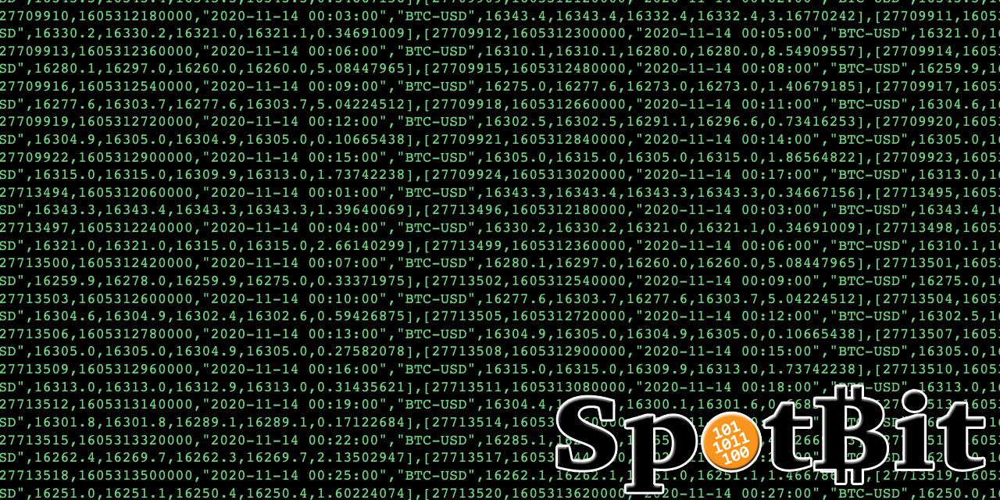

# Blockchain Commons Spotbit

### _by [Christian Murray](https://github.com/watersnake1) and [Christopher Allen](https://github.com/ChristopherA) with [Jo](https://github.com/jodobear)_
*  ***part of the [gordian](https://github.com/BlockchainCommons/gordian/blob/master/README.md) technology family***
*  ***uses [torgap](https://github.com/BlockchainCommons/torgap/blob/master/README.md) technology***


Price feeds for Bitcoin can be a privacy hole when wallets, users, or automated tools access them without using Tor or a secure proxy. If a user's wallets or tools access a preconfigured price feed, the user is potentially vulnerable to [Sybil attacks](https://en.wikipedia.org/wiki/Sybil_attack). **Spotbit's** purpose is to allow users to access price feeds in a customisable way that preserves privacy and mitigate the reliance on a single source of data.

**Spotbit** is a portable API for Bitcoin price data and candles. It can aggregate data from over 100 exchanges and serve them from a single URL or using Tor as an onion hidden service. It is configurable so that the user can decide which base currencies to use (USDT, USD, EUR etc), and which exchanges to use for price data.

Users may choose to run their own local **Spotbit** server, or to connect to a hosted **Spotbit** service.

#### Why Use Spotbit?

1. **Privacy.** Spotbit can work as a Tor hidden service.
1. **Reliability.** Spotbit aggregrates information using the exchanges/sources you configure, making your pricing data more trustworthy.
1. **Self-sovereignty.** Spotbit can run from your server. 

### Features

- Fetch Bitcoin prices from a set of exchanges.(See the API documentation [here](http://tmb6kcuihnpfyrxfsjgtvasthenvr43n6pcjhyml6fprgyzydvf5atyd.onion/docs))
- Produce a beancount report of the transactions associated with a Bitcoin descriptor.
- Web front-end with price data visualisation.  

## Additional Information

* Spotbit depends on the [CCXT](https://github.com/ccxt/ccxt) which provides an abstraction for API access to cryptocurrency exchanges.

### Test Server
A spotbit instance is currently running at `h6zwwkcivy2hjys6xpinlnz2f74dsmvltzsd4xb42vinhlcaoe7fdeqd.onion`. This instance is on a dedicated Blockchain Commons server.

### Related Projects

Spotbit is intended for integration with the [Gordian system](https://github.com/BlockchainCommons/Gordian), which consists of Tor-gapped components such as [Gordian Wallet](https://github.com/BlockchainCommons/GordianWallet-iOS) and a [Gordian Server](https://github.com/BlockchainCommons/GordianServer-macOS) or other server installed by [Bitcoin Standup scripts](https://github.com/BlockchainCommons/Bitcoin-StandUp-Scripts).

## Gordian Principles

Spotbit is a microservice intended to help realise the [Gordian Principles](https://github.com/BlockchainCommons/Gordian#gordian-principles) underpinning Blockchain Commons' Gordian technology stack and the Gordian Architecture. These principles are:

* **Independence.** Users can choose which applications to use within an open ecosystem.
* **Privacy.** Airgaps provide data with strong protection, while torgaps do the same for networked interactions.
* **Resilience.** The paritioned design minimizes Single Points of Compromise.
* **Openness.** Airgaps and torgaps are connected via standard specifications such as URs, which allow anyone to add apps to the ecosystem.

Blockchain Commons apps do not phone home and do not run ads. Some are available through various app stores; all are available in our code repositories for your usage.

## Status - Late Alpha

Spotbit is currently under active development and in the late alpha testing phase. It should not be used for production tasks until it has had further testing and auditing.

### Roadmap

Ongoing maintenance and features are listed in the repository's "issues" page.

- [x] June 2020: Completion of research and planning.
- [x] August 2020: Completed first working setup, began alpha testing.
- [x] September 2020: Released alpha versions 2 and 3, continued testing, improved install scripts, deployed to a linode server.
- [x] Late 2020: Support custom rules for price construction, alpha version 4, deploy spotbit to more remote servers, complete spotbit website.
- 2021 - : Ongoing maintenance and features are listed in the repository's "issues" page.

## Development setup

Requirements

+ Python3.10+
+ Nodejs

Create a virtual environment
```
python -m venv env/
```

Activate virtual environment
```
source env/bin/activate
```

Install dependencies
```
python -m pip install -r requirements.txt
```

Run
```
python app.py
```

## Installation Instructions

Spotbit includes a script called `installSpotbit.sh` which installs Spotbit and configures Tor on a Debian-based linux system. 

```console
$ git clone https://github.com/BlockchainCommons/spotbit.git
$ cd spotbit
$ chmod +x installSpotbit.sh
$ sudo -s source ./installSpotbit.sh 
```

The installer will: 
- Install and setup tor on your system, 
- Create a user named `spotbit` in a `spotbit` group that controls the hidden service directory location at `/var/lib/tor/spotbit`. 
- Copy Spotbit sourcecode to `/home/spotbit/source`
    - The user should update the default `spotbit.config` with their desired configuration.
- Create a `systemd` service unit file in `/etc/systemd/system`. 
- Set up a Tor hidden service for Spotbit. 

## Usage Instructions

To run the server, run `sudo systemctl start spotbit`. 

You can check on a spotbit's status at any time by running `sudo systemctl status spotbit`, or take a look at the log file in `/home/spotbit/source/spotbit.log`. 

The Spotbit API schema can be found by browsing to: <http://localhost:5000/docs>

## Origin, Authors, Copyright & Licenses

Unless otherwise noted (either in this [/README.md](./README.md) or in the file's header comments) the contents of this repository are Copyright © 2020 by Blockchain Commons, LLC, and are [licensed](./LICENSE) under the [spdx:BSD-2-Clause Plus Patent License](https://spdx.org/licenses/BSD-2-Clause-Patent.html).

In most cases, the authors, copyright, and license for each file reside in header comments in the source code. When it does not, we have attempted to attribute it accurately in the table below.

This table below also establishes provenance (repository of origin, permalink, and commit id) for files included from repositories that are outside of this repo. Contributors to these files are listed in the commit history for each repository, first with changes found in the commit history of this repo, then in changes in the commit history of their repo of their origin.

| File      | From                                                         | Commit                                                       | Authors & Copyright (c)                                | License                                                     |
| --------- | ------------------------------------------------------------ | ------------------------------------------------------------ | ------------------------------------------------------ | ----------------------------------------------------------- |
| exception-to-the-rule.c or exception-folder | [https://github.com/community/repo-name/PERMALINK](https://github.com/community/repo-name/PERMALINK) | [https://github.com/community/repo-name/commit/COMMITHASH]() | 2020 Exception Author  | [MIT](https://spdx.org/licenses/MIT)                        |

### Dependencies

To use Spotbit you'll need to use the following tools:

- Python3.8 or higher (some libraries don't work as needed on older versions of Python)
- Pip
- Flask
- CCXT - 

All of these Python libraries can be installed via pip and Python3.8 can be installed for you in the install script.

### Motivation
Spotbit aims to provide an easy option for aggregating exchange data that does not require the use of a third party data website like Coinmarketcap. These data can be used inside of other apps or for personal use / analysis. Acquiring data across many exchanges can be a pain because normally one would need write slightly different code in order to interact with each API. 

### Derived from…
This  Spotbit project is either derived from or was inspired by the need of Fully Noded 2 to display realtime price info in-app:

- [FullyNoded 2](https://github.com/BlockchainCommons/FullyNoded-2) — The mobile app for managing a BTC node via Tor, by [Fonta1n3](https://github.com/Fonta1n3).

## Financial Support

Spotbit is a project of [Blockchain Commons](https://www.blockchaincommons.com/). We are proudly a "not-for-profit" social benefit corporation committed to open source & open development. Our work is funded entirely by donations and collaborative partnerships with people like you. Every contribution will be spent on building open tools, technologies, and techniques that sustain and advance blockchain and internet security infrastructure and promote an open web.

To financially support further development of Spotbit and other projects, please consider becoming a Patron of Blockchain Commons through ongoing monthly patronage as a [GitHub Sponsor](https://github.com/sponsors/BlockchainCommons). You can also support Blockchain Commons with bitcoins at our [BTCPay Server](https://btcpay.blockchaincommons.com/).

## Contributing

We encourage public contributions through issues and pull requests! Please review [CONTRIBUTING.md](./CONTRIBUTING.md) for details on our development process. All contributions to this repository require a GPG signed [Contributor License Agreement](./CLA.md).

### Discussions

The best place to talk about Blockchain Commons and its projects is in our GitHub Discussions areas.

[**Gordian Developer Community**](https://github.com/BlockchainCommons/Gordian-Developer-Community/discussions). For standards and open-source developers who want to talk about interoperable wallet specifications, please use the Discussions area of the [Gordian Developer Community repo](https://github.com/BlockchainCommons/Gordian-Developer-Community/discussions). This is where you talk about Gordian specifications such as [Gordian Envelope](https://github.com/BlockchainCommons/BCSwiftSecureComponents/blob/master/Docs/00-INTRODUCTION.md), [bc-shamir](https://github.com/BlockchainCommons/bc-shamir), [Sharded Secret Key Reconstruction](https://github.com/BlockchainCommons/bc-sskr), and [bc-ur](https://github.com/BlockchainCommons/bc-ur) as well as the larger [Gordian Architecture](https://github.com/BlockchainCommons/Gordian/blob/master/Docs/Overview-Architecture.md), its [Principles](https://github.com/BlockchainCommons/Gordian#gordian-principles) of independence, privacy, resilience, and openness, and its macro-architectural ideas such as functional partition (including airgapping, the original name of this community).

[**Gordian User Community**](https://github.com/BlockchainCommons/Gordian/discussions). For users of the Gordian reference apps, including [Gordian Coordinator](https://github.com/BlockchainCommons/iOS-GordianCoordinator), [Gordian Seed Tool](https://github.com/BlockchainCommons/GordianSeedTool-iOS), [Gordian Server](https://github.com/BlockchainCommons/GordianServer-macOS), [Gordian Wallet](https://github.com/BlockchainCommons/GordianWallet-iOS), and [SpotBit](https://github.com/BlockchainCommons/spotbit) as well as our whole series of [CLI apps](https://github.com/BlockchainCommons/Gordian/blob/master/Docs/Overview-Apps.md#cli-apps). This is a place to talk about bug reports and feature requests as well as to explore how our reference apps embody the [Gordian Principles](https://github.com/BlockchainCommons/Gordian#gordian-principles).

[**Blockchain Commons Discussions**](https://github.com/BlockchainCommons/Community/discussions). For developers, interns, and patrons of Blockchain Commons, please use the discussions area of the [Community repo](https://github.com/BlockchainCommons/Community) to talk about general Blockchain Commons issues, the intern program, or topics other than those covered by the [Gordian Developer Community](https://github.com/BlockchainCommons/Gordian-Developer-Community/discussions) or the 
[Gordian User Community](https://github.com/BlockchainCommons/Gordian/discussions).
### Other Questions & Problems

As an open-source, open-development community, Blockchain Commons does not have the resources to provide direct support of our projects. Please consider the discussions area as a locale where you might get answers to questions. Alternatively, please use this repository's [issues](./issues) feature. Unfortunately, we can not make any promises on response time.

If your company requires support to use our projects, please feel free to contact us directly about options. We may be able to offer you a contract for support from one of our contributors, or we might be able to point you to another entity who can offer the contractual support that you need.

### Credits

The following people directly contributed to this repository. You can add your name here by getting involved. The first step is learning how to contribute from our [CONTRIBUTING.md](./CONTRIBUTING.md) documentation.

| Name              | Role                | Github                                            | Email                                 | GPG Fingerprint                                    |
| ----------------- | ------------------- | ------------------------------------------------- | ------------------------------------- | -------------------------------------------------- |
| Christopher Allen | Principal Architect | [@ChristopherA](https://github.com/ChristopherA) | \<ChristopherA@LifeWithAlacrity.com\> | FDFE 14A5 4ECB 30FC 5D22  74EF F8D3 6C91 3574 05ED |
| Christian Murray | Lead Developer | [@watersnake1](https://github.com/watersnake1) | \<Christian.B.Murray.21@Dartmouth.edu\> | 9A44 D707 5580 A022 8A99  8CEC 0178 C17E 95C7 BA35 |
| Jo | Install Script Developer | [@jodobear](https://github.com/jodobear) | \<\> | EE06 0B4A 9AED 976B 7CBD B3A0 3A9C 7E87 3028 4351 |
| Gautham Ganesh Elango | Developer, Integration with Gordian Wallet, Testing | [@gg2001](https://github.com/gg2001) | \<gautham.gg@gmail.com\> | AB93 8223 226D 9511 4499 A6E5 420E 32E3 5B3F DBA2 |

## Responsible Disclosure

We want to keep all of our software safe for everyone. If you have discovered a security vulnerability, we appreciate your help in disclosing it to us in a responsible manner. We are unfortunately not able to offer bug bounties at this time.

We do ask that you offer us good faith and use best efforts not to leak information or harm any user, their data, or our developer community. Please give us a reasonable amount of time to fix the issue before you publish it. Do not defraud our users or us in the process of discovery. We promise not to bring legal action against researchers who point out a problem provided they do their best to follow the these guidelines.

### Reporting a Vulnerability

Please report suspected security vulnerabilities in private via email to ChristopherA@BlockchainCommons.com (do not use this email for support). Please do NOT create publicly viewable issues for suspected security vulnerabilities.

The following keys may be used to communicate sensitive information to developers:

| Name              | Fingerprint                                        |
| ----------------- | -------------------------------------------------- |
| Christopher Allen | FDFE 14A5 4ECB 30FC 5D22  74EF F8D3 6C91 3574 05ED |
| Christian Murray |  9A44 D707 5580 A022 8A99  8CEC 0178 C17E 95C7 BA35|

You can import a key by running the following command with that individual’s fingerprint: `gpg --recv-keys "<fingerprint>"` Ensure that you put quotes around fingerprints that contain spaces.
